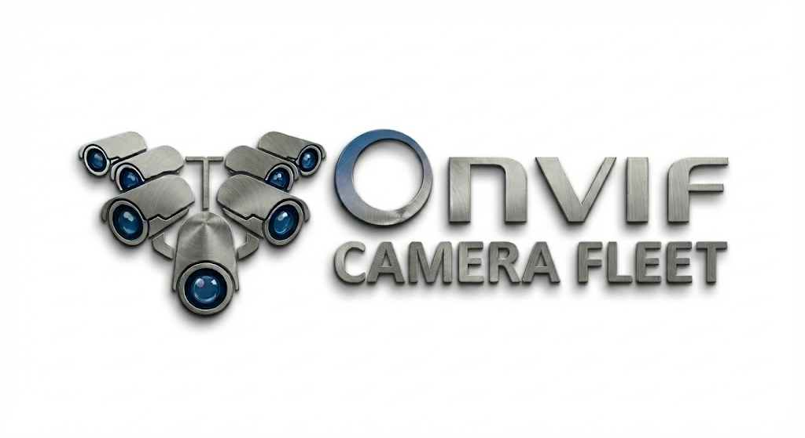

<p align="center">
  
</p>

# ONVIF Device Simulation

A Docker-based setup for creating virtual ONVIF cameras that can be discovered and accessed as real IP cameras on your local network. This project uses macvlan networking to give each virtual camera its own IP address and MAC address, making them appear as physical devices to ONVIF clients.

## Features

- Virtual ONVIF cameras with unique IP addresses and MAC addresses
- RTSP video streaming served directly from each camera's IP address
- Full ONVIF protocol support for device discovery and control
- Configurable video quality settings (high/low quality streams)
- Support for multiple camera instances
- Combined container architecture (ONVIF + MediaMTX in single container)

## Architecture

Each virtual camera runs as a single container with both services:

```
┌─────────────────────────────────────┐
│  onvif-cam1 (10.0.0.230)            │
│  ├── ONVIF Server (port 80)         │
│  └── MediaMTX RTSP (port 8554)      │
└─────────────────────────────────────┘

┌─────────────────────────────────────┐
│  onvif-cam2 (10.0.0.229)            │
│  ├── ONVIF Server (port 80)         │
│  └── MediaMTX RTSP (port 8554)      │
└─────────────────────────────────────┘
```

This means:
- ONVIF discovery at `http://10.0.0.230` returns RTSP URL `rtsp://10.0.0.230:8554/cam1`
- Both services share the same IP address per camera
- No separate host shim required for external access

## Prerequisites

- Docker and Docker Compose
- Linux host with network interface access
- Works on any architecture (ARM64, x86_64, etc.)
- Video files for streaming (MP4 format recommended)
- arp-scan for network discovery:
  - Ubuntu/Debian: `sudo apt-get install arp-scan`
  - macOS: `brew install arp-scan`
  - RHEL/CentOS: `sudo yum install arp-scan`

## Installation

### 1. Clone and Setup Project

```bash
git clone <this-repository>
cd onvif-devices
```

### 2. Build the Combined Image

Build the combined image that includes both ONVIF server and MediaMTX:

```bash
docker build -t onvif-camera:combined .
```

This creates a single image containing:
- MediaMTX RTSP server
- Node.js ONVIF server (pulled from `ghcr.io/daniela-hase/onvif-server`)
- Entrypoint script that runs both services

### 3. Generate Network Configuration

Use the configuration generator to automatically detect your network and suggest settings:

```bash
# Run with sudo for best network scanning
sudo ./scripts/generate-config.sh

# Or specify options
sudo ./scripts/generate-config.sh -i eth0 -c 2 -w

# See all options
./scripts/generate-config.sh -h
```

This script will:
- Automatically detect your network subnet and gateway
- Scan for used IP addresses using arp-scan
- Suggest available IPs for cameras
- Generate unique MAC addresses
- Optionally write the configuration to `.env` file

## Configuration

### Network Configuration (.env)

The configuration generator creates a `.env` file. You can also edit it manually:

```bash
# Ethernet NIC for macvlan
PARENT_IF=eth0

# Your LAN
LAN_SUBNET=10.0.0.0/24
LAN_GATEWAY=10.0.0.1

# Virtual ONVIF devices (unique IPs + MACs)
# Each container runs ONVIF + MediaMTX, so RTSP is served from same IP
CAM1_IP=10.0.0.230
CAM1_MAC=02:11:22:A2:01:01
CAM2_IP=10.0.0.229
CAM2_MAC=02:11:22:A2:02:02

# Host directory containing video files (mounted as /media in container)
VIDEO_DIR=/home/pi/Videos
```

**Important**: Make sure the camera IPs are static or adjust your DHCP pool from your router to prevent IP conflicts.

### Camera Configuration Files

Each camera has its own YAML configuration file. After updating `.env`, ensure the MAC addresses match:

**onvif-cam1-macvlan.yaml:**
```yaml
onvif:
  - mac: 02:11:22:A2:01:01          # Must match CAM1_MAC in .env
    name: Cam1
    uuid: 9f3d2c1e-bbcd-4f6a-9f0b-2e5a7a4e9c61
    ports: { server: 80, rtsp: 8554, snapshot: 8080 }
    target:
      hostname: 10.0.0.230          # Must match CAM1_IP in .env
      ports: { snapshot: 8080 }
    highQuality: { rtsp: "/cam/realmonitor?channel=1&subtype=0&unicast=true&proto=Onvif", width: 1920, height: 1080, framerate: 25, bitrate: 4096 }
    lowQuality:  { rtsp: "/cam/realmonitor?channel=1&subtype=1&unicast=true&proto=Onvif", width: 640,  height: 360,  framerate: 10, bitrate: 512 }
```

**Key configuration points:**
- `mac`: Must match the corresponding `CAM{N}_MAC` in `.env`
- `ports.rtsp`: The port advertised in ONVIF responses (8554)
- `target.hostname`: The camera's own IP address (for RTSP URL generation)
- `target.ports`: Only include `snapshot` (not `rtsp`) to avoid proxy conflicts

### MediaMTX Configuration

Each camera has its own MediaMTX config file (`mediamtx-cam1.yml`, `mediamtx-cam2.yml`):

```yaml
rtsp: yes
rtspAddress: :8554
rtspTransports: [udp, multicast, tcp]
hls: yes
webrtc: yes

paths:
  "cam/realmonitor":
    source: publisher
    runOnInit: ffmpeg -stream_loop -1 -re -i /media/video.mp4 -c:v copy -c:a copy -f rtsp "rtsp://127.0.0.1:8554/cam/realmonitor"
    runOnInitRestart: yes
```

### Video Preparation

Convert your video files to ONVIF-compatible format using FFmpeg:

```bash
ffmpeg -i /path/to/input/video.mp4 -vf scale=1280:720,fps=15 -pix_fmt yuv420p \
  -c:v libx264 -preset slow -crf 23 -g 30 -sc_threshold 0 \
  -c:a aac -ar 48000 -ac 1 -b:a 96k /path/to/output/video.mp4
```

Place your converted video files in the directory specified by `VIDEO_DIR` in your `.env` file (defaults to `/home/pi/Videos`).

## Deployment

### 1. Start Services

```bash
docker compose up -d
```

### 2. Verify Deployment

Check if containers are running:

```bash
docker compose ps
```

Expected output:
```
NAME         IMAGE                   COMMAND            SERVICE      STATUS
onvif-cam1   onvif-camera:combined   "/entrypoint.sh"   onvif-cam1   Up
onvif-cam2   onvif-camera:combined   "/entrypoint.sh"   onvif-cam2   Up
```

View logs:

```bash
docker compose logs -f
```

You should see:
- MediaMTX starting and opening RTSP listener on port 8554
- ONVIF server starting on port 80
- FFmpeg publishing video to the RTSP path

## Usage

### Accessing ONVIF Cameras

Once deployed, your virtual cameras will be accessible at:

| Camera | ONVIF Discovery | RTSP Stream |
|--------|-----------------|-------------|
| Cam1 | `http://10.0.0.230` | `rtsp://10.0.0.230:8554/cam/realmonitor?channel=1&subtype=0&unicast=true&proto=Onvif` |
| Cam2 | `http://10.0.0.229` | `rtsp://10.0.0.229:8554/cam/realmonitor?channel=1&subtype=0&unicast=true&proto=Onvif` |

### Testing RTSP Streams

From any machine on your network:

```bash
# Test with ffprobe
ffprobe "rtsp://10.0.0.230:8554/cam/realmonitor?channel=1&subtype=0&unicast=true&proto=Onvif"

# Play with ffplay
ffplay "rtsp://10.0.0.230:8554/cam/realmonitor?channel=1&subtype=0&unicast=true&proto=Onvif"

# Play with VLC
vlc "rtsp://10.0.0.230:8554/cam/realmonitor?channel=1&subtype=0&unicast=true&proto=Onvif"
```

### ONVIF Discovery

Use ONVIF-compatible software to discover devices:
- ONVIF Device Manager
- VLC Media Player
- Security camera software (Blue Iris, Shinobi, etc.)
- Custom ONVIF clients

When you query the stream URI via ONVIF, you'll receive:
```
rtsp://10.0.0.230:8554/cam/realmonitor?channel=1&subtype=0&unicast=true&proto=Onvif
```

## Project Structure

```
onvif-devices/
├── scripts/
│   ├── generate-config.sh            # Network configuration generator
│   ├── macvlan-setup.sh              # Optional: Host shim setup (for local access)
│   └── macvlan-cleanup.sh            # Optional: Host shim cleanup
├── .env                              # Network configuration
├── .env.example                      # Example configuration
├── docker-compose.yml                # Docker Compose file
├── Dockerfile                        # Combined image (ONVIF + MediaMTX)
├── entrypoint.sh                     # Container entrypoint script
├── mediamtx-cam1.yml                 # MediaMTX config for camera 1
├── mediamtx-cam2.yml                 # MediaMTX config for camera 2
├── onvif-cam1-macvlan.yaml          # ONVIF config for camera 1
├── onvif-cam2-macvlan.yaml          # ONVIF config for camera 2
└── README.md                         # This file
```

## Host Access (Optional)

By default, the host machine running Docker **cannot** access the macvlan containers directly (this is a macvlan limitation). Other machines on your network can access the cameras without any issues.

If you need to access cameras from the Docker host itself:

1. Add `HOST_SHIM_IP` to your `.env`:
   ```bash
   HOST_SHIM_IP=10.0.0.250/24
   ```

2. Run the macvlan setup script:
   ```bash
   ./scripts/macvlan-setup.sh
   ```

3. Now you can access cameras from the host via the shim interface.

## Troubleshooting

### Network Issues

1. **Containers can't be reached from other machines**:
   - Verify the macvlan network was created: `docker network ls | grep cam_net`
   - Check container IPs: `docker exec onvif-cam1 ip addr show eth0`
   - Ensure no IP conflicts with existing devices

2. **IP conflicts**:
   - Ensure camera IPs don't conflict with DHCP range
   - Use static IPs or configure DHCP reservations

3. **Can't access cameras from Docker host**:
   - This is expected with macvlan - use host shim (see "Host Access" section above)
   - Or test from another machine on the network

### Service Issues

1. **ONVIF server not responding**:
   - Check container logs: `docker logs onvif-cam1`
   - Verify the combined image was built: `docker images | grep onvif-camera`

2. **No video streams**:
   - Ensure video files exist in your `VIDEO_DIR`
   - Check logs for FFmpeg errors: `docker logs onvif-cam1 | grep -i ffmpeg`

3. **RTSP URL shows "undefined" port**:
   - Ensure `ports.rtsp: 8554` is set in the ONVIF YAML config
   - Ensure `target.ports` does NOT include `rtsp` (only `snapshot`)

### Docker Issues

1. **"invalid subinterface vlan name" error (Docker 29.x)**:

   Docker 29.x has a bug that incorrectly parses interface names like `enp10s0` as VLAN subinterfaces. The workaround is to create an interface alias with a simpler name:

   ```bash
   # Create an alias for your interface
   sudo ip link add link enp10s0 name eth0 type macvlan mode bridge
   sudo ip link set eth0 up

   # Update .env to use the alias
   PARENT_IF=eth0
   ```

   Replace `enp10s0` with your actual interface name. To make this persistent across reboots, add the commands to `/etc/rc.local` or create a systemd service.

2. **Network pool overlap error**:
   ```bash
   docker network rm onvif-devices_cam_net
   docker compose up -d
   ```

3. **Container name conflicts**:
   ```bash
   docker compose down
   docker compose up -d
   ```

### Debugging Commands

```bash
# Check container status
docker compose ps

# View logs
docker compose logs -f

# Check specific container
docker logs onvif-cam1

# Verify container IP
docker exec onvif-cam1 ip addr show eth0

# Test RTSP from another machine
ffprobe "rtsp://10.0.0.230:8554/cam/realmonitor?channel=1&subtype=0&unicast=true&proto=Onvif"

# Restart services
docker compose restart
```

## Stopping Services

```bash
# Stop and remove containers
docker compose down

# If using host shim, clean it up
./scripts/macvlan-cleanup.sh
```

## Adding More Cameras

1. Add new camera variables to `.env`:
   ```bash
   CAM3_IP=10.0.0.228
   CAM3_MAC=02:11:22:A2:03:03
   ```

2. Create `onvif-cam3-macvlan.yaml` (copy from cam1/cam2 and update values)

3. Create `mediamtx-cam3.yml` (copy from cam1/cam2)

4. Add new service to `docker-compose.yml`:
   ```yaml
   onvif-cam3:
     image: onvif-camera:combined
     container_name: onvif-cam3
     restart: unless-stopped
     networks:
       cam_net:
         ipv4_address: ${CAM3_IP}
     mac_address: ${CAM3_MAC}
     volumes:
       - ./onvif-cam3-macvlan.yaml:/onvif.yaml:ro
       - ./mediamtx-cam3.yml:/mediamtx.yml:ro
       - ${VIDEO_DIR:-/home/pi/Videos}:/media:ro
   ```

5. Restart: `docker compose up -d`
